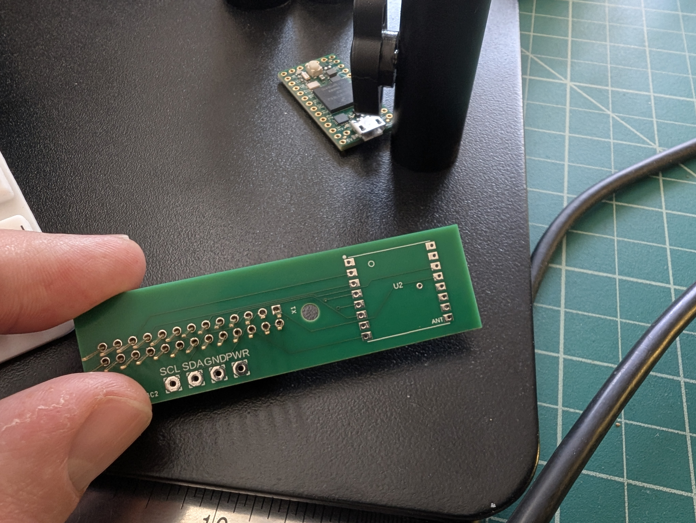
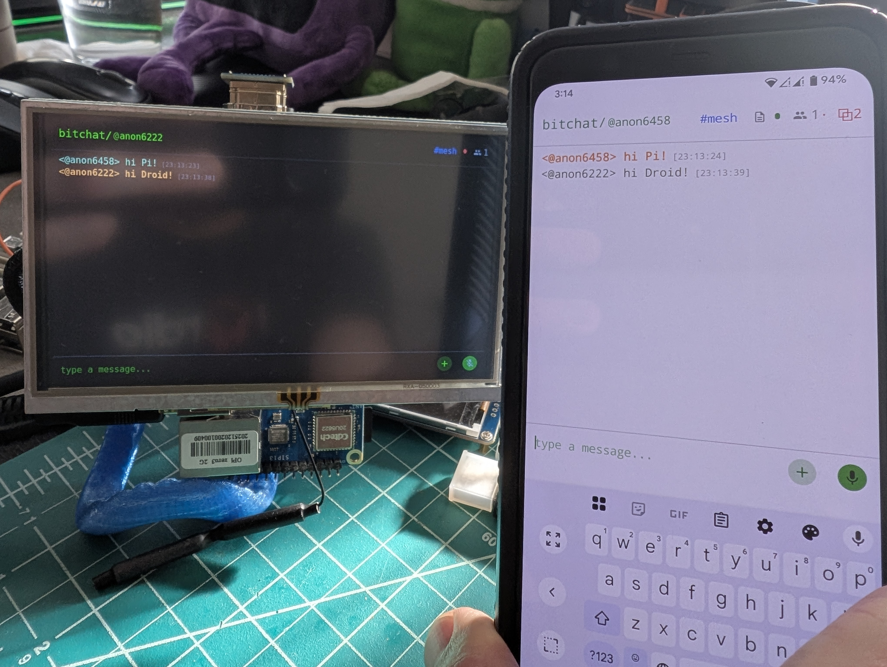

# Bitchat KMP

Kotlin Multiplatform rewrite of Bitchat.
- https://github.com/permissionlesstech/bitchat
- https://github.com/permissionlesstech/bitchat-android

This project keeps protocol-level compatibility with legacy clients while adding a Linux ARM64 embedded target (Orange Pi + touchscreen + CardKB + LoRa).

## What This Project Contains

- `domain`: business logic contracts and models.
- `data:*`: repositories + transport/crypto/network implementations.
- `presentation:*`: shared design system, screens, and viewmodels.
- `apps:*`: platform applications (`desktop`, `droid`, `iosApp`, `embedded`).
- `iosdi`: shared KMP framework used by iOS.

## Prerequisites

### All platforms

- **JDK 17+** — required for Gradle and Kotlin compilation
- **Git** with submodule support

### Android

- Android SDK with API level 36 and Build Tools
- Set `ANDROID_SDK_ROOT` (or create `local.properties` with `sdk.dir=...`)

### iOS

- Xcode (with command-line tools: `xcode-select --install`)
- Rust toolchain with iOS targets (`rustup target add aarch64-apple-ios x86_64-apple-ios aarch64-apple-ios-sim`)

### Desktop (macOS)

- Xcode command-line tools
- Homebrew packages for macOS native crypto targets:
  ```bash
  brew install libsodium secp256k1
  ```
- Rust toolchain (`rustup` — needed to build Arti/Tor)

### Linux ARM64 (embedded)

- Docker (cross-compilation runs inside containers)

## Quick Start

### 1. Clone with submodules

The project uses git submodules for native C libraries (libsodium, secp256k1, noise-c, Arti, gattlib). These **must** be initialized or native targets will fail to compile.

```bash
# Option A: clone with submodules in one step
git clone --recurse-submodules <repo-url>

# Option B: if you already cloned without submodules
git submodule update --init --recursive
```

> **If you skip this step**, builds targeting iOS, macOS native, or Linux ARM64 will fail with missing header errors (e.g., `sodium.h`, `secp256k1.h`, `noise/protocol.h`).

### 2. Build native dependencies for your target(s)

The pre-compiled static libraries (`.a` files) are **not** checked into the repo. You must build them from the submodule sources before compiling native targets.

```bash
cd bitchatKmp/

# Build for all platforms at once
./scripts/build-all-platforms.sh

# Or build only what you need:
./scripts/build-all-ios.sh        # iOS
./scripts/build-all-android.sh    # Android (Arti/Tor only)
./scripts/build-all-desktop.sh    # macOS desktop
./scripts/build-all-linux.sh      # Linux ARM64 (embedded)
```

> **Android and Desktop (JVM) builds** that don't use native cinterop (the common case) will work **without** this step — they pull crypto dependencies from Maven (BouncyCastle, Tink). This step is only required for iOS, macOS native, and Linux ARM64 targets.

### 3. Build and run

```bash
# Android
./gradlew :apps:droid:installDebug

# Desktop (macOS)
./gradlew :apps:desktop:clean :apps:desktop:run -PbleNative=macos --rerun-tasks

# Desktop + macOS location native bindings
./gradlew :apps:desktop:clean :apps:desktop:run -PbleNative=macos -PlocationNative=macos --rerun-tasks
```

For iOS, open `apps/iosApp/iosApp.xcodeproj` in Xcode. Build the shared framework first:
```bash
./gradlew :presentation:screens:iosArm64Binaries        # device
./gradlew :presentation:screens:iosSimulatorArm64Binaries # simulator
```

## What Each Platform Needs

| Target | Submodules | Native build script | Homebrew packages | Notes |
|--------|-----------|---------------------|-------------------|-------|
| Android | No | No | No | Uses Maven deps (BouncyCastle). Just needs Android SDK. |
| Desktop (JVM) | No | No | No | Uses Maven deps. Works out of the box. |
| Desktop (macOS native BLE/Tor) | Yes | `build-all-desktop.sh` | `libsodium secp256k1` | Needed for `-PbleNative=macos` and Arti/Tor. |
| iOS | Yes | `build-all-ios.sh` | No | Builds libsodium, secp256k1, noise-c, Arti from source via Xcode toolchain. |
| Linux ARM64 (embedded) | Yes | `build-all-linux.sh` | No | Cross-compiles inside Docker. Requires `embedded.enabled=true` in `gradle.properties`. |

## Native Library Builds

Use wrapper scripts in `scripts/` rather than invoking per-module native scripts directly.

| Platform | Script | Prerequisites |
|----------|--------|---------------|
| All | `./scripts/build-all-platforms.sh` | All below |
| iOS | `./scripts/build-all-ios.sh` | Xcode, Rust |
| Android | `./scripts/build-all-android.sh` | Android NDK, Rust |
| Desktop (macOS) | `./scripts/build-all-desktop.sh` | Xcode, Rust |
| Linux (ARM64) | `./scripts/build-all-linux.sh` | Docker |

Linux ARM64 cross-compiles native deps inside Docker and writes outputs to `data/*/build/linux-arm64/`.

### Native submodules overview

| Submodule | Path | Used by |
|-----------|------|---------|
| [libsodium](https://github.com/jedisct1/libsodium) | `data/crypto/native/libsodium` | iOS, macOS, Linux ARM64 crypto |
| [secp256k1](https://github.com/bitcoin-core/secp256k1) | `data/crypto/native/secp256k1` | iOS, macOS, Linux ARM64 crypto |
| [noise-c](https://github.com/rweather/noise-c) | `data/noise/native/noise-c` | iOS, macOS, Linux ARM64 Noise protocol |
| [Arti](https://gitlab.torproject.org/tpo/core/arti) | `data/remote/tor/native/arti` | iOS, macOS, Linux ARM64, Android Tor |
| [gattlib](https://github.com/labapart/gattlib) | `data/remote/transport/bluetooth/native/gattlib` | Linux ARM64 BLE |

## Troubleshooting

### `fatal: No url found for submodule path '...'`
Run `git submodule update --init --recursive` from the repo root.

### `sodium.h: No such file or directory` (or `secp256k1.h`, `noise/protocol.h`)
The native libraries haven't been built. Run the appropriate build script from `scripts/` (see table above).

### macOS desktop build fails looking for libsodium/secp256k1
Install via Homebrew: `brew install libsodium secp256k1`. The macOS cinterop config expects headers at `/opt/homebrew/opt/`.

### `libarti_ios.a` / `libarti_macos.a` not found
Run `./scripts/build-all-ios.sh` or `./scripts/build-all-desktop.sh`. You need Rust installed (`curl --proto '=https' --tlsv1.2 -sSf https://sh.rustup.rs | sh`).

## Embedded Device Quickstart (Orange Pi)

1. Build native linuxArm64 dependencies:
   ```bash
   ./scripts/build-all-linux.sh
   ```
2. Build the embedded binary:
   ```bash
   ./gradlew :apps:embedded:linkReleaseExecutableLinuxArm64
   ```
3. Deploy to device:
   ```bash
   scp apps/embedded/build/bin/linuxArm64/releaseExecutable/bitchat-embedded.kexe user@<orangepi-ip>:/tmp/
   ```
4. Run on device:
   ```bash
   ssh user@<orangepi-ip> '/tmp/bitchat-embedded.kexe'
   ```

For full setup (display, touch, CardKB, LoRa protocol stack), use the docs map below.

## Documentation Map

### Known Hardware Baseline

- Orange Pi Zero 3 (Armbian, linuxArm64)
- Elecrow 5" HDMI display with XPT2046 resistive touch
- M5Stack CardKB (I2C keyboard)
- RFM95W / SX1276-class LoRa module (via RangePi HAT)

> **RangePi status:** The RangePi LoRa HAT is **not working** — it can transmit data but received packets cannot be decoded on the other end. This is a work in progress and has been set aside for now.

### Core embedded paths

| Guide | Use when |
|-------|----------|
| [`docs/meshcore-orangepi-setup.md`](docs/meshcore-orangepi-setup.md) | You want BitChat MeshCore companion mode (`meshcored` on TCP 5000). |
| [`docs/meshtastic-orangepi-setup.md`](docs/meshtastic-orangepi-setup.md) | You want Meshtastic interoperability (`meshtasticd` on TCP 4403). |

### Embedded component setup

| Guide | Purpose |
|-------|---------|
| [`apps/embedded/docs/LORA_SETUP.md`](apps/embedded/docs/LORA_SETUP.md) | Canonical LoRa wiring and SPI/GPIO baseline on Orange Pi Zero 3. |
| [`apps/embedded/docs/TOUCH_SETUP.md`](apps/embedded/docs/TOUCH_SETUP.md) | Elecrow/XPT2046 touch setup and daemon approach. |
| [`apps/embedded/docs/CARDKB_SETUP.md`](apps/embedded/docs/CARDKB_SETUP.md) | M5Stack CardKB I2C keyboard setup and systemd driver install. |
| [`apps/embedded/docs/CROSS_COMPILE_LINUX_ARM64.md`](apps/embedded/docs/CROSS_COMPILE_LINUX_ARM64.md) | Native dependency cross-compilation details for linuxArm64. |
| [`apps/embedded/docs/BLUETOOTH_LINUX_ARM64.md`](apps/embedded/docs/BLUETOOTH_LINUX_ARM64.md) | BLE stack setup for linuxArm64 boards. |

## Native/Platform Notes

- `data:remote:transport:bluetooth`: native BLE bindings; desktop may bundle dylibs via `-PbleNative=macos`.
- `data:local:platform`: platform services (for example macOS location via `-PlocationNative=macos`).
- `data:remote:tor`: Tor/Arti native libs copied into desktop runtime via Gradle.
- `data:noise`, `data:crypto`: native crypto dependencies (Noise, libsodium, secp256k1).


                     
                                                                                                                                                                     
   
    